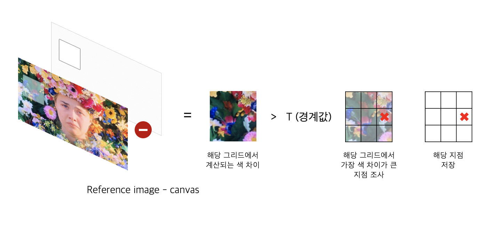

# Painterly Rendering

'Painterly Rendering with Curved Brush Strokes of Multiple Sizes' 논문을 읽은 후, 

추가적인 교수님의 피드백 및 지시에 따라 요구사항에 맞게 변형하여 진행

---

# Summary

### 목표

- **브러시의 모양과 레이어, 요철** 등을 구현해 사진 이미지를 input으로 넣으면 유화 느낌이 나는 output을 산출

### Stack

- OpenCV
- C++
- MFC

### 기간

- 2020.01.08 ~ 2020.04.08

    → 2학년 겨울방학 ~ 3학년 1학기

---

# 프로젝트 최종 산출물

(좌) 원본 / (우) 프로젝트 산출물 (K : 그림자의 강도 0.18 적용)

(좌) 원본 / (우) 프로젝트 산출물 (K : 그림자의 강도 0.15 적용)

# 구현 내용들

### 스트로크가 쌓이는 원리

- 스트로크는 포토샵의 독립적인 레이어처럼 구현됩니다
- 가장 밑바닥의 레이어부터 '브러시 스트로크를 찍어야 할 지점들'을 조사한 후 해당 레이어의 스트로크 위치 조사가 모두 끝나면 레이어 단위로 스트로크들을 한 번에 찍게 됩니다
1. 레이어의 진행 상황에 따라
    1. 전반부 레이어의 경우

        

        reference image와 output canvas의 색 차이가 충분히 큰 경우 스트로크의 위치를 저장하며, 반대로 충분히 크지 않은 경우에는 스트로크의 위치를 저장하지 않고 넘어갑니다

    2. 후반부 레이어의 경우

        

        후반부 레이어의 경우, 이미 브러시가 충분히 쌓인 상태이므로 Saliency값이 높아 세밀한 묘사가 필요한 부분에 브러시가 더 그어질 수 있도록 적용했습니다

2. 브러시 스트로크가 쌓이는 과정

    ❗스트로크를 찍을 때, 차후 요철 적용을 위해 브러시의 누적 높이를 저장합니다

    

    레이어에서 브러시 스트로크 지점들의 조사가 끝나면 한 번에 스트로크가 찍히게 됩니다

    

    input brush의 밝기를 토대로 배경색과 브러시 색을 섞어 스트로크를 찍습니다.

### 브러시 요철 적용

스트로크를 찍어주는 과정에서 저장했던, 캔버스에 쌓인 브러시의 높이를 이용합니다

1. 요철을 추가하는 과정

    

    A벡터와 B벡터를 내적해 평면에 수직인 N벡터를 얻어 햇빛의 방향을 나타내는 L벡터를 내적한 후, 해당 값을 원래 캔버스의 색에 곱해 그림자를 표현해 줄 수 있습니다

2. 내적값과 그림자의 세기 K값(0~1)에 따라 그림자 적용
    - N⋅L > 0

        `K(N⋅L) * 원래 색상 + (1 - K) * 원래 색상`

    - N⋅L ≤ 0

        `(1 - K) * 원래 색상`

### 브러시의 종류에 따라 다른 스타일의 이미지 출력

브러시의 종류의 차이를 더 가시적으로 잘 보여드리기 위해 아직 요철은 적용시키지 않은 이미지들입니다

- 적용한 브러시

    

    왼쪽부터 차례로 1, 2, 3, 4번 브러시입니다

    - 최종 결과에서는 4번 브러시를 사용

### Bilateral Filtering or Gaussian Blurring

- 더 매끄러운 유화 이미지를 위해 input으로 들어가는 reference image에 Bilateral Filtering or Gaussian Blurring 적용
    - 적용 전후 비교 결과

        

        Filtering을 적용한 경우, 부자연스러운 붓질이 사라진 매끄러운 결과를 확인할 수 있습니다

        

        두 옵션은 선택 가능합니다

### Saliency가 높은 곳에 더 집중적으로 브러시가 칠해지도록 구현

- Saliency map을 이용해 이미지에서 Saliency가 높은(눈길이 더 잘 가는) 곳에 더 집중적으로 브러시가 칠해지도록 구현
    - Saliency map의 예시

        

---

# 알고리즘 구조도

당시 발표자료의 크기 제한으로, 가로로 길게 제작하지 못해 가독성이 다소 떨어지는 점 양해 부탁드리겠습니다

---
